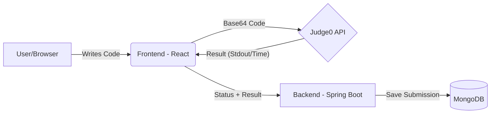

# Code Arena - Technical Documentation

## 🏗️ Architecture Overview

Code Arena follows a modern decoupled architecture consisting of three primary layers:

1.  **Frontend (React):** Responsibility for UI/UX, state management, and orchestration of code execution requests.
2.  **Backend (Spring Boot):** Responsibility for user authentication, persistence (MongoDB), and content management (Problems/Contests).
3.  **Code Execution Engine (Judge0):** Isolated environment for executing untrusted code and returning results.

### High-Level Data Flow

---

## 🧠 State Management: AppContext

The application uses the React Context API via `AppContext.jsx` to manage global state across the platform.

### Key State Variables:
- `userDetails`: Stores information about the logged-in user.
- `isLoggedIn`: Boolean flag for authentication status.
- `allProblem`: Cached list of all available coding problems.
- `allContest`: Cached list of upcoming and ongoing contests.
- `isAdmin`: Boolean flag identifying if the current user has administrative privileges.

---

## 🛠️ Features Deep Dive

### 1. Code Execution Flow
When a user submits code:
- **Encoding:** The code is Base64 encoded to safely handle special characters.
- **Injection:** Relevant driver code (stored in `src/data/driverCode.js`) is optionally appended to test logic against hidden cases.
- **Judge0 Integration:** The code is sent to Judge0 with the `?wait=true` parameter for synchronous processing.
- **Verification:** The frontend receives the raw output and matches it against expected test cases to determine the final status.

### 2. DSA learning Hub
The DSA Hub (organized in `src/components/DsaRevision`) dynamically generates content from `src/data/DsaTopics.js`. It provides:
- Multiple code templates (C++, Java, Python, JS) for every topic.
- Tabbed view for Theory and Implementation.
- Persistence of user progress (planned).

### 3. Algorithm Visualizer
Uses a custom rendering engine built on top of React state to visualize algorithm steps.
- **Sorting:** Uses delays and color-coded bars to show swapping/partitioning.
- **Graph/Tree:** Utilizes canvas or SVG-based rendering for traversal visualization.

---

## 🔐 Security & Authentication

- **JWT:** All requests to protected backend routes require a `Bearer` token in the `Authorization` header.
- **Spring Security:** Backend uses filter chains to validate JWTs and authorize specific roles (e.g., `ROLE_ADMIN`).
- **Input Sanitization:** Code is executed in an isolated Judge0 sandbox to prevent RCE (Remote Code Execution) on the main backend.

---

## 🛰️ API Reference (Key Endpoints)

| Endpoint | Method | Description | Access |
| :--- | :--- | :--- | :--- |
| `/user/login` | POST | Authenticate and get JWT | Public |
| `/problem/fetch` | GET | Retrieve all coding problems | User |
| `/admin/fetchUsers` | GET | List all users for dashboard | Admin |
| `/contest/create` | POST | Create a new coding contest | Admin |
| `/userProfile/get` | GET | Fetch profile stats for current user | User |

---

## 🚀 Development Guidelines

### Adding a New Problem
1. Define the problem in the Admin Panel or add it to the `dsaProblem.jsx` data file.
2. Ensure you provide at least one valid test case and expected output.
3. (Optional) Provide a code template for each supported language.

### Modifying the Visualizer
- Visualization logic is located in `src/components/Algovisualizer`.
- Use the `useState` hook to track the current state of data structures at each step of the algorithm.
