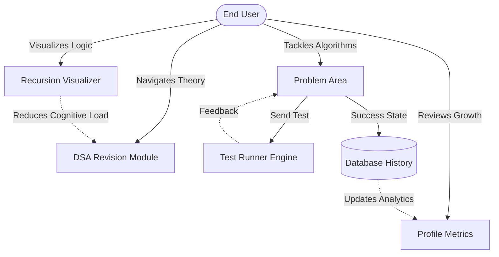

# CHAPTER 1: PROBLEM FORMULATION

In any extensive software engineering endeavor, clearly articulating the problem geometry is crucial for defining the bounds, constraints, and architecture of the final application. This chapter outlines the foundational ideology behind the creation of **Code-Arena**, mapping the current technological landscape, isolating user pain points, and presenting a cohesive set of functional requisites that dictate the development lifecycle of the platform.

## 1.1 Introduction about the Company / Context

Traditionally, this section describes the corporate ecosystem wherein an application is deployed. However, in the realm of an independent project targeting the wider educational and competitive programming demographic, the context spans across the generic scope of technical interviewing, educational pedagogy, and EdTech (Educational Technology). 

The modern technology job market enforces a rigid selection criteria centered around a candidate's aptitude in Data Structures and Algorithms (DSA). From emerging startups to immense Fortune 500 tech conglomerates (often referred to as FAANG), technical interviews consistently involve white-boarding complex algorithmic theories. Consequently, a multi-million dollar secondary industry has evolved solely dedicated to "interview-prep". 

The entity or ecosystem that Code-Arena belongs to is this global EdTech infrastructure. Rather than being deployed as an internal tool restricted within a walled-garden enterprise, Code-Arena functions as a publicly facing, open-platform Software-as-a-Service (SaaS) tool built dynamically to serve undergraduate students, self-taught programmers, and seasoned engineers looking to sharpen their skills. The "company" philosophy driving this project is analogous to open-source communities—prioritizing transparency, accessibility, and high visual fidelity to streamline the steep learning curve traditionally associated with computational sciences. 

## 1.2 Introduction about the Problem

### The Cognitive Complexity of Algorithms
Programming relies on a heavy degree of abstract conceptualization. Unlike front-end GUI development, where output is instantaneous and distinctly visible, the behavior of an algorithm—especially those involving backtracking or deep tree logic—occurs exclusively inside the hidden memory layer of the machine. The core problem inherently lies in this "black box" execution.

When computer science students are introduced to algorithms like Depth First Search (DFS), merge sort, or dynamic programming arrays, they rely on textual print statements to trace execution. This traditional approach:
1. Prevents a holistic understanding of how data mutates across time and scope.
2. Severely limits the ability to conceptually visualize tree-structures and node relationships.
3. Increases debug times exponentially as candidates are forced to trace 50-node deep stack traces merely utilizing logs.

### The Problem with Disjointed Architecture
A secondary problem rests in the segregation of the current tech ecosystem. Currently, students must rely on highly segregated systems:
- They use GitHub repositories or local PDFs to read structured theory (revisions).
- They navigate to execution platforms to practice.
- They utilize entirely separate, often clunky toolsets or native IDEs if they desperately need dynamic debugging.
- They utilize Excel sheets to track their progression metrics over time.

This disparate experience fragments user concentration. Context-switching directly decreases cognitive retention, generating a stressful and highly inefficient learning loop. What is missing is a unified ecosystem that integrates theory (`DsaRevision`), practice (`Submission`), evaluation (`Profile`), and cognitive visualization (`Algovisualizer`).

### 1.3 Present State of the Art

To comprehensively justify the creation of a new application, a thorough appraisal of the current state of the art is required. Today, numerous powerful tools operate within this space. Table 1.1 outlines the primary platforms that define the competitive algorithmic environment today:

***Table 1.1: Comparative evaluation of State-of-the-Art Competitive Platforms***

| Platform Name | Primary Target Demographic | Strengths | Major Limitations / Shortcomings in Context of EdTech |
| :--- | :--- | :--- | :--- |
| **LeetCode** | Interview Candidates | Enormous question database; industry-standard tracking. | Overwhelming for beginners. Almost zero visual aids for execution. Premium-gated features trap students. |
| **HackerRank** | Corporations doing pre-screening | Highly stable compiler infrastructure; HR integration suites. | UI feels dated; heavily focused on corporative assessment rather than educational acceleration. |
| **Codeforces** | Extreme Competitive Programmers | High-frequency contests; rigorous mathematical culture. | Extremely brutal learning curve; poor UI; minimal textual explanations or pedagogical features. |
| **VisuAlgo** | University Academics | Excellent 2D visualizations of classic algorithms. | Cannot run custom code. Highly static. Lacks an integrated progress-tracking user profile. |

As indicated in the table, the present state of the art represents a distinct dichotomy: platforms are either built explicitly for hardcore, high-volume testing (LeetCode, Codeforces) or built exclusively for passive animation viewing (VisuAlgo). 

Currently, no mainstream platform fluidly bridges this divide. The industry lacks a platform where a user can seamlessly jump from a detailed, topic-by-topic theoretical breakdown of an algorithmic archetype, immediately attempt a related problem, and, in real-time, generate a dynamic UI model reflecting how their algorithm manipulates the stack map. 

## 1.4 Need of Computerization

While modern platforms inherently utilize computers, the specific 'Need for Computerization' in the context of this project refers to the necessity of pushing computational limits via modern frameworks (React.js, Node.js) to automate cognitive tasks historically done on paper.

1. **Automating the Mental Stack Trace:**
Tracking a recursive call stack manually requires a pen and paper mapped out meticulously over several minutes. Computerization, specifically the `useTreeEngine.js` architecture developed for this application, automatically maps an array of operations into a strictly formulated spatial tree in milliseconds.
2. **Automated User Tracking:**
A centralized web server provides constant data concurrency. Rather than manual spreadsheets tracking problem completion or reliance on local-storage (which collapses across distinct devices), the MERN stack integration ensures that a user's submission metrics are stored, calculated, and fetched securely. Automation generates progress bars and pie-charts instantaneously inside the Profile module.
3. **Automated Algorithmic Judging:**
A key requirement of competitive environments is immediate feedback. When a user submits an answer to an algorithm, waiting for manual grading is impossible. The computerized backend pipeline intercepts the raw text buffer, injects dummy test cases, compares payload outputs, and derives a boolean judgment (`Accepted` vs `Wrong Answer`) in less than a second, accelerating the feedback cycle.
4. **Scalable Revision Delivery:**
By utilizing an automated routing engine, hundreds of discrete theoretical modules (such as Array traversals, Graph properties, String manipulatives) can be mapped efficiently without the need for hundreds of static hard-coded pages layout issues.

## 1.5 Proposed Software / Project

To directly address the problems and shortcomings mapped in previous sections, the proposed software is **Code-Arena**, a unified web application serving as a comprehensive toolkit for students preparing for technical interviews. The platform is compartmentalized into specific interconnected, highly cohesive functional modules:

### A. The DSA Revision Module
A cleanly designed, hierarchical documentation interface allowing users to navigate through various computational theories. The platform breaks down algorithms mathematically, utilizing rich text generation, distinct code-blocks, and modern sidebar typography explicitly optimized for readability in dark mode, avoiding eye strain during long study sessions.

### B. The Coding Arena (Problem Management)
A split-pane terminal-like workflow specifically mimicking highly professional IDEs environments (like VS Code). On the left, problem definitions, constraints, and constraints are clearly parsed. On the right, a multi-file buffer interfaces with the user's keystrokes. It includes custom, localized test-runner modules allowing users to run small-scale debugging logic against immediate mock properties before committing to the deeper server architecture.

### C. The Active Profile Analytics System
A dedicated `Profile.jsx` dashboard summarizing user activity. It computes database endpoints to compile recent submissions into temporal graphs and displays topic mastery parameters. It is uniquely tailored to calculate not just completion velocity but submission accuracy, pushing the candidate towards optimized, first-try accuracy rather than random guessing.

### D. The Dynamic Algorithm Visualizer (Core USP)
The central nervous system of the project’s proposition. This module executes custom recursive engine logic. Leveraging animation libraries like Framer Motion, it translates generic function payloads into gorgeous, physics-based nodes. It features an interactive timeline controller, allowing a user to literally "play, pause, step-back, and step-forward" through computational time. It replaces a simple array text log with a sprawling SVG tree highlighting active, pending, and exhausted calls.

***Diagram 1.1: High-Level Conceptual Interaction of Code-Arena Modules***

*(Note: Diagram 1.1 conceptually proves that despite distinct modules, the data and usability intrinsically feed back into the core user experience)*

## 1.6 Importance of the work

The necessity to undertake this massive architectural endeavor stems directly from an educational deficit. The importance of the work can be categorized across multiple parameters:

**1. Personal Skill Engineering (Educational Importance)**
By providing a platform that emphasizes immediate visual confirmation of logic, the project accelerates the speed at which a junior engineer becomes proficient. Mastering complex state-manipulation logic, like Dynamic Programming (DP) state-caching, has historically gated candidates from top-tier opportunities. Code-Arena democratizes this complexity.

**2. Technological Innovation within the Component (Technical Importance)**
Building complex animation engines in WebDOM without relying on heavy WebGL abstraction layers requires intricate mathematics regarding layout, spacing, mapping logic states to UI updates, and strict memory management. From a technical perspective, constructing the Recursion Visualizer pushes the boundary of what browser-rendered pure React logic can achieve efficiently before stalling the thread. It requires learning optimization hooks, pure engine refactoring, and state synchronization—vital industrial skills.

**3. Economic and Societal Value**
Given the immense pressure on undergraduate students securing high-paying placements, EdTech platforms invariably lock premium cognitive features behind expensive subscriptions. Code-Arena's importance relies heavily on its proposition as an accessible resource, effectively lowering the barrier of entry for quality technical preparation.

The combination of these factors dictates that Code-Arena is not merely an exercise in rote React.js coding, but an exploratory, impactful endeavor into software architecture and human-computer psychology. This fundamentally justifies the allocation of engineering resources detailed extensively in the operational and system analysis outlined in subsequent chapters.
