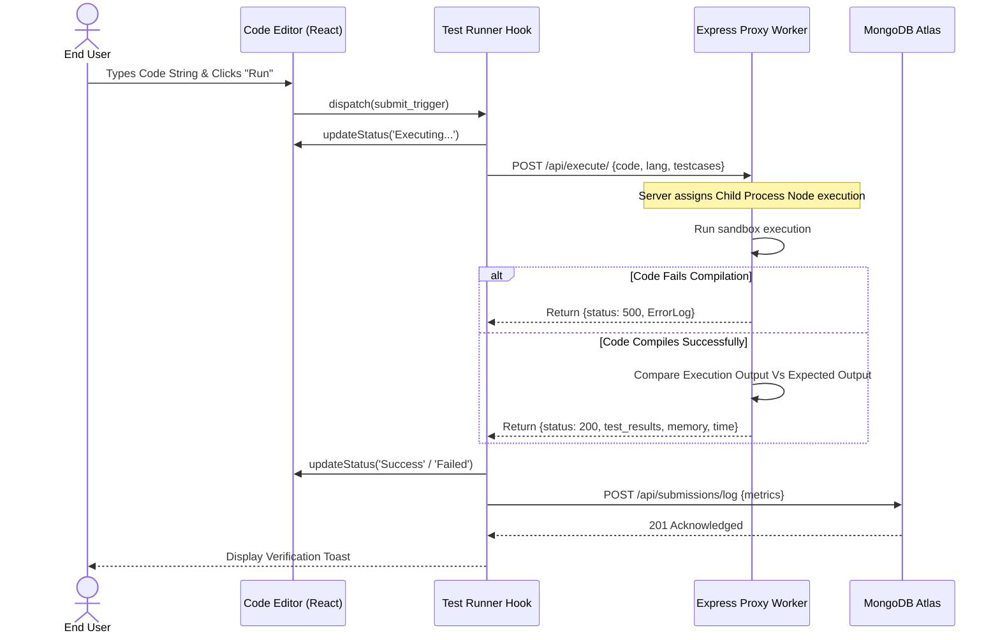
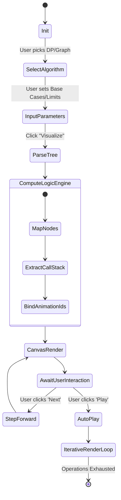
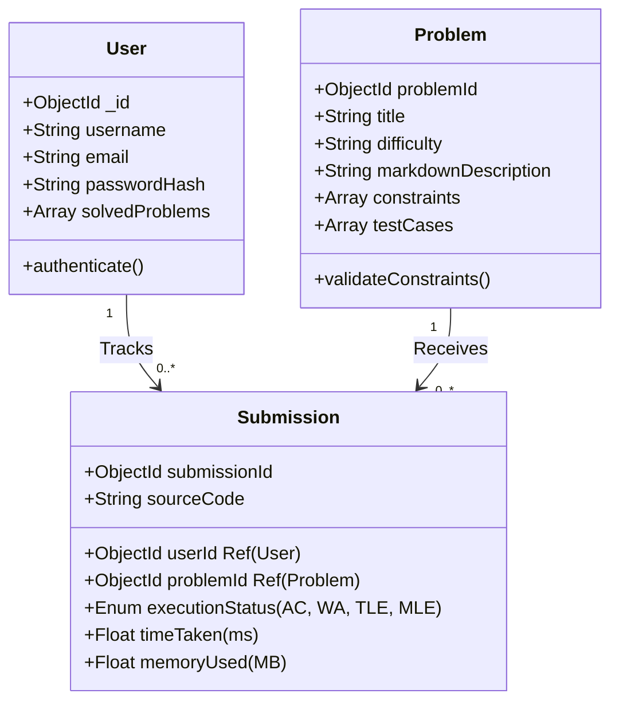
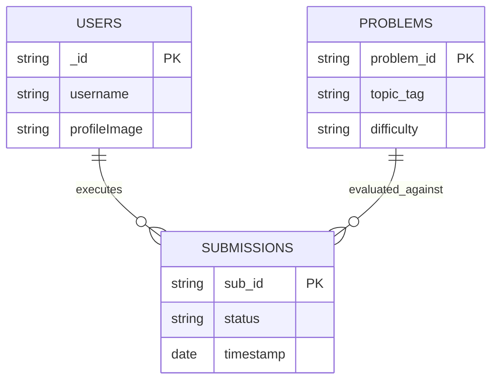

# CHAPTER 3: SYSTEM DESIGN

System design acts as the architectural blueprint. Building a complex application like Code-Arena without robust design models inevitably triggers severe structural collapse, circular dependencies, and tangled states. This chapter defines the precise topologies, interactions, flow, and schema structuring that dictatrs how Code-Arena resolves logic, manages state, and scales.

## 3.1 Design Methodology

The selected design methodology is **Object-Oriented Design (OOD)** heavily augmented by **Component-Driven Architecture**. By treating the interface as a series of isolated, reusable components (like the `<SearchInterface />`, `<RevisionLayout />`, `<Submission />`, and `<ExecutionControls />`), we ensure a highly decoupled front end. Consequently, the backend adopts a strict **Model-View-Controller (MVC) Pattern** to segregate database manipulation (Models) from logical processing (Controllers) and REST payload routing (Routes/Views). 

## 3.2 UML Modeling

Unified Modeling Language (UML) defines standard methodologies for describing system topologies visually. 

### 3.2.1 Use Case Diagram
A Use Case diagram models the system from a strict user-interaction perspective, isolating distinct actors and defining their authorized boundaries.

***Diagram 3.1: Code-Arena High-Level Use Case Topology***

```flowchart LR
    %% Define Actors
    Student(("Student"))
    Administrator(("Administrator"))
    
    %% Define System Boundary (Package)
    subgraph System ["Code-Arena System Space"]
        direction TB
        UC1(["Sign Up / Authenticate"])
        UC2(["Browse DSA Modules"])
        UC3(["Launch Recursion Visualizer"])
        UC4(["Solve Active Problems"])
        UC5(["View Profile & Analytics"])
        UC6(["Manage Problem Database"])
    end
    
    %% Define Relationships
    Student --> UC1
    Student --> UC2
    Student --> UC3
    Student --> UC4
    Student --> UC5
    
    Administrator --> UC1
    Administrator --> UC6
    Administrator --> UC5
```
*(The diagram above illustrates that generic Users execute core logic flows, whereas Administrators contain elevated override access to the problem engine DB).*

### 3.2.2 Sequence Diagram
Sequence diagrams document the exact temporal progression of messages exchanged between objects during a specific lifecycle operation. We analyze the most complex operation: submitting code to the Test Runner.

***Diagram 3.2: Code Submission Temporal Sequence***



### 3.2.3 Activity Diagram
Activity Diagrams represent workflows of step-wise activities and constraints. Below is the active flow for the `Recursion Visualizer`.

***Diagram 3.3: Recursion Visualizer Logic Flow***



### 3.2.4 Class Diagram
Object structures within the JavaScript backend heavily map to Mongoose schemas. Diagram 3.4 captures the underlying model relation framework.

***Diagram 3.4: Class/Schema Relational Map***



## 3.3 Database Design

Database structuring is absolutely fundamental to ensure that application queries execute at optimized speeds without imposing excessive iteration complexity. Utilizing MongoDB avoids rigid alter-table commands, fostering rapid schema development.

### 3.3.1 Entity Relationship Diagram (ERD)

The relational mapping is inherently focused on three hyper-nodes: **USERS**, **PROBLEMS**, and **SUBMISSIONS**.

***Diagram 3.5: Chen’s ERD Notation Conceptual Map***



### 3.3.2 Data Flow Diagram (DFD)

Data flow diagrams represent process pipelines tracking how raw bytes turn into evaluated information structures. 

**Level 0 DFD (Context Model):**
- **User** sends credentials and problem solution buffers to the **Code-Arena Central System**.
- **Code-Arena Central System** returns Verification Tokens, Execution Metrics, and Visual Animation nodes to the **User**.

**Level 1 DFD (Decomposed System):**
1. **User Auth Node:** Intercepts strings, checks MongoDB Database `Users`. Returns JWT token.
2. **Revision Node:** Intercepts clicks, fetches hardcoded or remote Markdown Strings, runs through remark/rehype markdown parsers, and returns formatted HTML blocks.
3. **Execution Node:** Intercepts active buffer code. Forwards request to local Docker or Node subprocess. Fetches array output. Validates against MongoDB `Problems.testcases`. Returns comparative JSON arrays.

## 3.4 Input Design

Data input forms represent the primary vulnerability gateway for the application regarding injection vulnerabilities or corrupt state configurations.
Input formatting across Code-Arena follows these principles:
- **Authentication Forms:** Strict regex filtering ensuring localized string verification before network requests.
- **Problem Filtering/Search Input:** Implementing debounce logic inside `<SearchInterface />`. As a user types problem names, requests are naturally paused until typing ceases, preventing 429 API rate limits.
- **Code Editor Buffer:** Utilizing specialized wrappers (e.g., CodeMirror or Monaco Editor logic structures) to support syntax highlighting, semantic tabbing, and bracket-matching directly on the input buffer. 

## 3.5 Output Design

Output design refers to how analytical and procedural data is explicitly represented to the end-user.
- **Test Case Feedback:** Output design relies on strict red/green visual dichotomy. Test cases resulting in `Accepted (AC)` return green pill highlights with runtime memory profiles. `Wrong Answer (WA)` returns red pill metrics explicitly displaying the expected stdout vs the user's stdout.
- **Recursion Visulaization:** The primary output. Trees are algorithmically rendered using specific XY coordinates. Nodes map dynamically: Active nodes glow inherently indicating execution stack pointers, exhausted node paths fade slightly minimizing visual noise, effectively drawing focus to the active frame in time.
- **Profile Output:** Analytical outputs leverage pie charts (Difficulty distribution) and line graphs (Submission frequency timelines) constructing an intuitive dashboard rather than raw tabular lists.

## 3.6 Code Design and Development (Architecture)

The codebase strictly adheres to modular functional boundaries designed heavily around Custom Hooks enabling clean render boundaries.

**Key Architecture Decisions:**
- `src/components/Algovisualizer/tree/useTreeEngine.js`: Built exclusively as an encapsulated hook. Rather than injecting logic into heavy functional elements, this hook accepts a structured tree and returns strict properties determining active depth, node limits, and animated step triggers.
- `src/hooks/useTestRunner.js`: Abstracts the complex logic of submitting code, caching temporary results dynamically, mapping pending variables, and polling the network, effectively separating server-communication syntax from the generic UI buttons.
- `src/Pages/...`: Route-based views ensure minimal initial loading by chunking logic aggressively based on relative user routing.

Through the careful application of these design modalities, the Code-Arena project is meticulously documented mapping internal system mechanics, preparing the software directly for efficient testing and implementation outlined in the subsequent chapter. 
