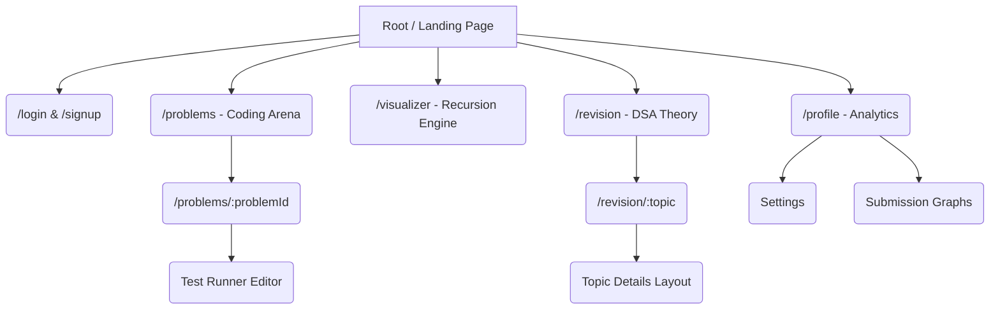
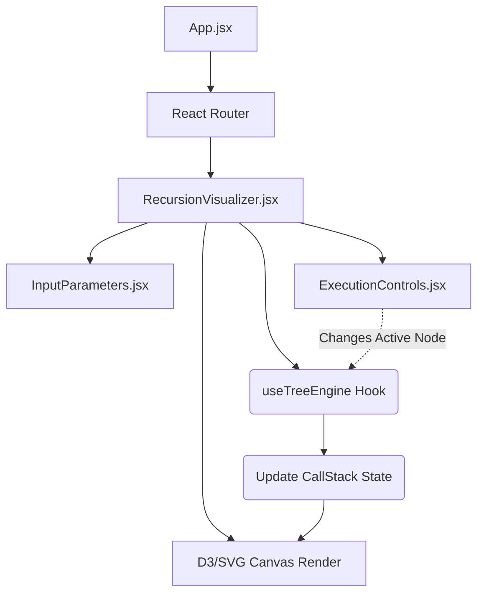

# CHAPTER 6: ANNEXURES

Annexures serve as supplementary visual and technical indexes appending the core report natively. These documents map the exact state components, dictionary parameters tracking inputs natively, and provide explicit structural directives utilized inherently during deployment.

*(Note for the Final Word Document rendering: Replace the text-bracket markers below with actual system screenshots capturing the designated UI views directly.)*

## A-1 Menu Flow Diagram

The Menu Flow diagram maps the nested navigational routes executed across the Code-Arena React Router DOM layer natively.

***Diagram 6.1: Code-Arena Frontend Routing Tree***



## A-2 Structure Chart

Structure charts depict the exact component hierarchy injected into the frontend React DOM logic directly. 

***Diagram 6.2: Component Rendering Hierarchy (Visualizer Example)***



## A-7 Data Dictionary

A Data Dictionary tracks the generic variable typings, defining data parameters universally referenced across the database architectures.

***Table 6.1: Database Dictionary Map Extract***

| Field Name | Type | Key Constraint | Description | Default Property |
| :--- | :--- | :--- | :--- | :--- |
| `_id` | ObjectId | Primary Key (Users) | Unique BSON identifier tracking user instance. | Native Mongo Hash |
| `username` | String | Unique | App-wide display alias. | Required parameter. |
| `passwordHash`| String | None | Encrypted bcrypt sequence. | Required parameter. |
| `problem_id` | ObjectId | Primary Key (Problems)| Matches specifically to problems. | Native Mongo Hash |
| `difficulty` | Enum | [Easy, Med, Hard] | Ranks the pedagogical challenge index natively. | 'Easy' |
| `constraints` | Array [String]| None | Text block explaining maximum array limits. | Empty Loop `[]` |
| `executionStatus`| Enum | [AC, WA, TLE, MLE]| Tracks the final judgement evaluated accurately. | 'WA' |
| `timeTaken_ms` | Float | None | Measures absolute millisecond duration logic execution. | 0.00 |

## A-8 Test Reports (Interfaces)

This section highlights the user interfaces generated dynamically tracking test reporting algorithms across the UI. 
- *Screenshot Annexure:*
  > **[INSERT SCREENSHOT: `testcases_success.png`]**
  > *Caption: Test Runner interface passing cleanly returning an array of Green Output Blocks displaying execution boundaries naturally.*

  > **[INSERT SCREENSHOT: `testcases_failed.png`]**
  > *Caption: Test runner returning `Wrong Answer`. Highlights explicitly where Expected `[1, 2, 3]` failed evaluating against computed `[1, 5, 3]` arrays.*

## A-9 Sample Inputs

Code-Arena tracks array logic across multiple parameters natively.
- **Problem: Merge Sort Parameters:**
  - `Input Form:` Array formatting requirements natively parsed string parameters: `[4, 2, 8, 3, 1]`

- **Problem: Recursion Node Thresholds:**
  - `Input Parameters:` Visualizer bounds limiting integer bounds logic natively mapping DP structures: `Base: 0, Input Size: 10`.

## A-10 Sample Outputs

- **Problem Validation Output (JSON):**
  ```json
  {
      "status": "Accepted",
      "runtime": 42.5,
      "memoryUsage": 32.1,
      "language": "javascript",
      "testResults": [
          {"id": 1, "passed": true, "stdout": "null"},
          {"id": 2, "passed": true, "stdout": "null"}
      ]
  }
  ```

- **Visualizer Output (Graph Nodes):**
  - *Screenshot Annexure:*
  > **[INSERT SCREENSHOT: `visualizer_callstack.png`]**
  > *Caption: The SVG rendering matrix mapping explicit tree node circles interconnected indicating temporal steps tracking logic operations globally.*

## A-11 Coding Highlights (Optional Technical Extracts)

Below tracks the pivotal algorithmic array mappings executing the React node structures efficiently inside the core architecture boundary natively.

**Core Extraction from `useTreeEngine.js` (State Manager Hook):**

```javascript
/* Extracted from Code-Arena Recursion Core Logic Structure */
const executeTreeTransformation = useCallback((nodes, activeIndex) => {
    // 1. Calculate active subset based on temporal parameter limits natively.
    const activeSubset = nodes.slice(0, activeIndex + 1);
    
    // 2. Map geometry parameters rendering XY coordinates recursively.
    return activeSubset.map((node) => ({
        id: node.id,
        value: node.value,
        x: calculateSpacialX(node.depth, node.position),
        y: node.depth * Y_OFFSET_CONSTANT,
        isActive: node.id === activeSubset[activeSubset.length - 1].id
    }));
}, [Y_OFFSET_CONSTANT]);
```

*(This code segment natively dictates the positional geometry formatting the graphical SVG parameters dynamically based strictly isolated computational frames).*
